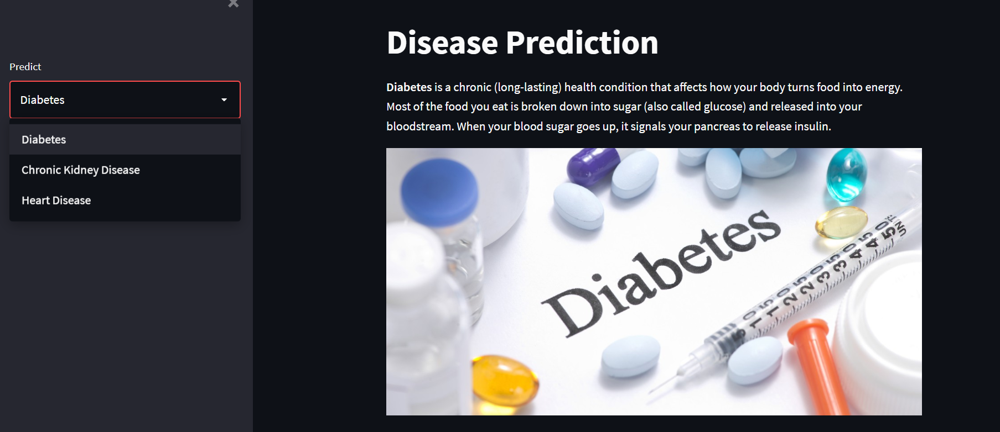
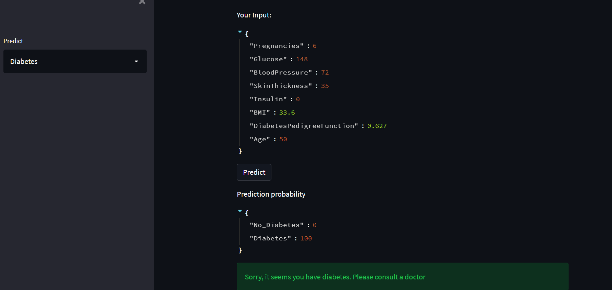
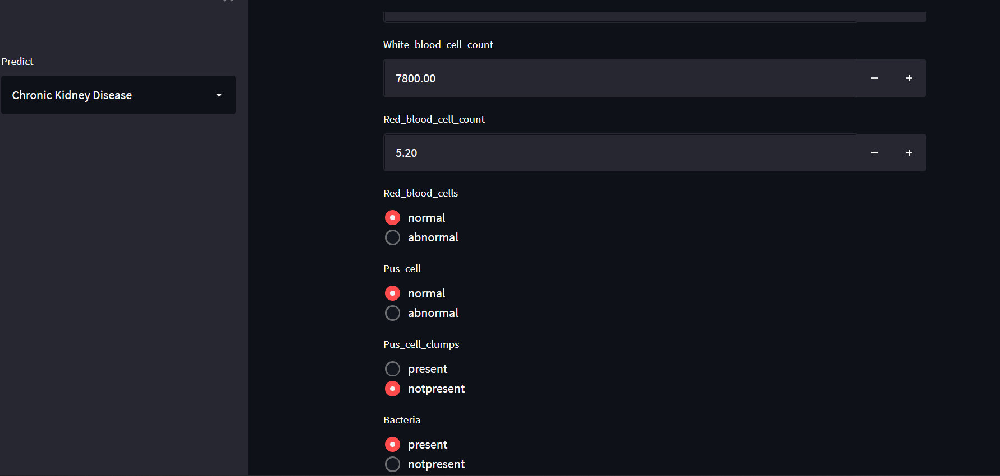
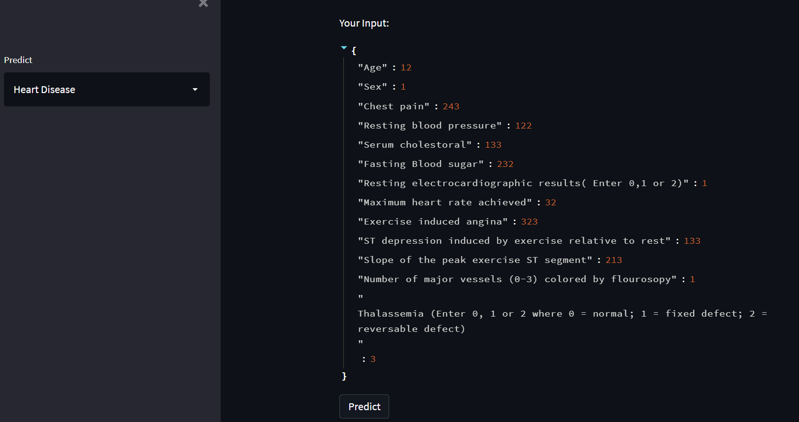

# Diseases Prediction

## Overview

* The application helps in checking the possibility of having certain diseases ( Diabetes, Chronic Kidney Diseses, Heart Problems) provided some conditions. It is developed using Streamlit framework

* Each model is trained with different machine leraning algorithms such as Logistic Regression, KNN, Decision Tree Classifier, Random Forest Classifier,and XgBoost to check for better predictions which is used in the application

